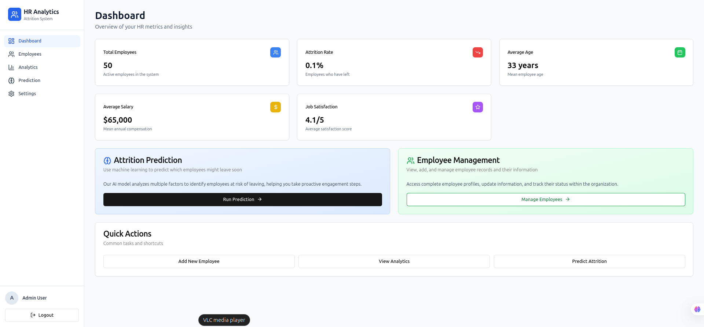

# 🧠 HR Analytics Attrition AI System

A full-stack machine learning platform for predicting and analyzing **employee attrition** — helping HR teams understand, retain, and empower their workforce.

---

## 🧩 Project Structure

```

hranalytics_attrition/
├── backend/      # FastAPI-based REST API (ML model + analytics + auth)
├── frontend/     # Next.js 15 dashboard for HR visualization & interaction
└── README.md     # This file (root summary)

````

Each folder (`backend/` and `frontend/`) includes its own detailed documentation.

---

## ⚙️ Tech Stack

| Layer | Technology |
|--------|-------------|
| **Backend** | FastAPI, SQLAlchemy, Pydantic, JWT, SQLite/PostgreSQL |
| **Machine Learning** | Scikit-learn, Pandas, NumPy |
| **Frontend** | Next.js 15, Tailwind CSS, Chart.js, Axios |
| **Auth & RBAC** | JWT-based authentication integrated with FastAPI |
| **Data** | HR employee attrition dataset (IBM HR Analytics base) |

---

## 🚀 Quick Start

### 1️⃣ Backend Setup
```bash
cd backend
python -m venv .venv
source .venv/bin/activate
pip install -r requirements.txt
uvicorn main:app --reload
````

API runs at → **[http://127.0.0.1:8000](http://127.0.0.1:8000)**

---

### 2️⃣ Frontend Setup

```bash
cd frontend
npm install --legacy-peer-deps
npm run dev
```

App runs at → **[http://localhost:3000](http://localhost:3000)**

Make sure to update the frontend `.env.local`:

```env
NEXT_PUBLIC_API_URL=http://127.0.0.1:8000
```

---

## 🔒 Authentication

* Login via frontend UI (uses FastAPI JWT)
* Logout clears local token
* Role-Based Access Control (RBAC):

  * **Admin:** Full access
  * **HR:** Predict & view analytics
  * **Viewer:** Read-only access

---

## 📊 Features

✅ Predict employee attrition using ML model
✅ Interactive HR dashboard (retention trends, salary satisfaction, etc.)
✅ Role-based access & secure authentication
✅ API-driven architecture for easy scaling
✅ Simple UI for non-technical HR staff

---


<p align="center">
  
</p>

```

